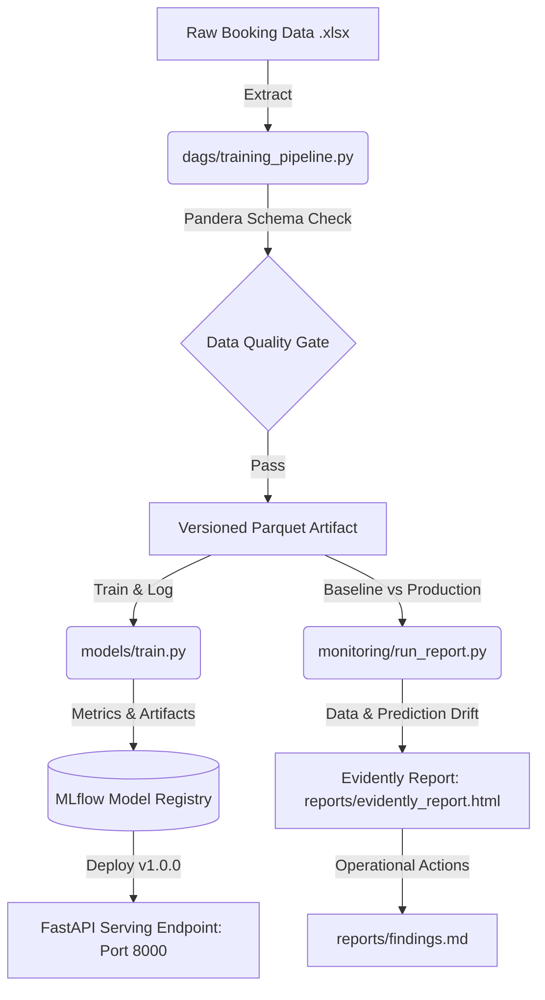

# Philippine Airlines (PAL) Passenger Market Segmentation - Full MLOps System

[](https://github.com/martinyamzon8/MLOps_LT5_FinalOutput_Milestone1/actions/workflows/ci.yml)

A complete, production-grade MLOps system that operationalizes a machine learning clustering model for Philippine Airlines (PAL) passenger market segmentation (e.g. *Business / Premium Traveler*, *Standard Leisure Traveler*, *Advance Booking / Group Travel*).

The system integrates all 5 architectural layers:
1. **Data Pipeline (M1):** Automated Airflow extraction, Pandera schema enforcement, and versioned Parquet artifact generation.
2. **Experiment Tracking & Model Registry (M2):** MLflow experiment tracking with logged hyperparameters, silhouette/Davies-Bouldin metrics, and registered models.
3. **Automated Testing & CI (M2):** Pytest test suite (>80% coverage) with data validation, model quality gates, API tests, and GitHub Actions CI.
4. **Model Serving Endpoint (Final):** FastAPI REST API containerized with Docker, Pydantic request validation (HTTP 422 enforcement), confidence score calculation, and health monitoring (`GET /health`, `POST /predict`).
5. **Monitoring Dashboard (Final):** Evidently AI statistical drift monitoring (`reports/evidently_report.html`) and operational interpretation (`reports/findings.md`).

---

## 1. System Architecture



---

## 2. Model Serving Endpoint (FastAPI)

The model serving endpoint is built with **FastAPI** and **Pydantic**, exposing clean RESTful interfaces with automated input validation and OpenAPI/Swagger documentation.

### Core Endpoints

| Method | Path | Description | Status Code |
| :--- | :--- | :--- | :--- |
| `GET` | `/health` | Live health probe & active model version verification | `200 OK` |
| `POST` | `/predict` | Predict passenger market segment & confidence score | `200 OK` / `422 Unprocessable` |
| `POST` | `/predict/batch` | Batch inference across multiple passenger reservations | `200 OK` |
| `GET` | `/docs` | Interactive Swagger UI API documentation | `200 OK` |
| `GET` | `/` | System root metadata | `200 OK` |

### Live Demo & API Usage

#### 1. Verify Endpoint Health (`GET /health`)
```bash
curl -X GET http://localhost:8000/health
```
**Response:**
```json
{
  "status": "ok",
  "model_version": "v1.0.0",
  "model_name": "PAL_Passenger_Segmenter",
  "model_source": "artifact (pal_passenger_segmenter_v1.0.0.joblib)",
  "timestamp": "2026-08-20T00:00:00.000000Z"
}
```

#### 2. Run Single Passenger Prediction (`POST /predict`)
```bash
# Windows PowerShell
Invoke-RestMethod -Uri "http://localhost:8000/predict" -Method Post -ContentType "application/json" -Body '{"PurchaseLeadTime": 14.0, "PAX_Count": 1, "AverageFare": 145.50}'

# cURL (Bash / Linux / macOS)
curl -X POST http://localhost:8000/predict \
  -H "Content-Type: application/json" \
  -d '{"PurchaseLeadTime": 14.0, "PAX_Count": 1, "AverageFare": 145.50}'
```
**Response:**
```json
{
  "status": "ok",
  "prediction": 1,
  "segment_name": "Business / Premium Traveler",
  "confidence": 0.9412,
  "model_version": "v1.0.0",
  "features": {
    "PurchaseLeadTime": 14.0,
    "PAX Count": 1,
    "AverageFare": 145.50
  }
}
```

#### 3. Schema Validation & Error Handling (HTTP 422)
If invalid data is sent (e.g. negative fare, PAX count < 1, negative lead time), the endpoint rejects the payload with HTTP **422 Unprocessable Entity** instead of crashing with HTTP 500:
```bash
curl -X POST http://localhost:8000/predict \
  -H "Content-Type: application/json" \
  -d '{"PurchaseLeadTime": 10.0, "PAX_Count": 0, "AverageFare": -50.0}'
```

---

## 3. Evidently AI Monitoring Dashboard & Findings

Statistical drift monitoring compares historical baseline data (`data/benchmark_data.parquet`) against production traffic (`data/sample_drifted_data.parquet`).

### Generate the Monitoring Dashboard
Run the monitoring script:
```bash
python monitoring/run_report.py
# Or with uv:
uv run python monitoring/run_report.py
```

Outputs:
- **Interactive HTML Report:** `reports/evidently_report.html` (Data Drift + Target/Prediction Drift).
- **Written Interpretation & Action Playbook:** `reports/findings.md`.

---

## 4. Running the Entire System Locally

### Prerequisites
- [uv](https://docs.astral.sh/uv/)
- [Docker & Docker Compose](https://www.docker.com/)

### 1. Install Local Dependencies
```bash
uv sync
```

### 2. Run Linting, Test Suite & Coverage
```bash
# Lint with Ruff (0 violations enforced)
uv run ruff check .

# Run all 25 automated unit, quality, and API tests
uv run pytest -v

# Run with test coverage (>80% line coverage)
uv run --with pytest-cov pytest --cov=api --cov=monitoring --cov=models --cov-report=term-missing
```

### 3. Launch Full Containerized Stack (Docker Compose)
```bash
docker compose up --build
```

This boots 4 orchestrated services:
- **FastAPI Serving Endpoint (`api`):** [http://localhost:8000](http://localhost:8000) (Interactive Swagger docs: [http://localhost:8000/docs](http://localhost:8000/docs))
- **MLflow Tracking Server & Model Registry (`mlflow`):** [http://localhost:5001](http://localhost:5001)
- **Airflow Orchestration (`airflow`):** [http://localhost:8080](http://localhost:8080)
- **PostgreSQL Database (`postgres`):** Metadata store on port 5432

To stop all containers:
```bash
docker compose down
```

---

## 5. Repository Structure

```
.
├── .github/
│   └── workflows/
│       └── ci.yml                     # GitHub Actions CI: lint -> test -> coverage
├── api/
│   ├── __init__.py
│   ├── main.py                        # FastAPI application with /health and /predict
│   ├── model_loader.py                # ModelService loader (MLflow registry & artifact fallback)
│   └── schemas.py                     # Pydantic request/response validation models
├── dags/
│   ├── pipeline_logic.py              # Pandera data validation schema & extract/load logic
│   └── training_pipeline.py           # Airflow DAG orchestrating ETL pipeline
├── data/                              # Synthetic PAL booking datasets (no real PII)
│   ├── raw/                           # Raw booking export sheets
│   ├── benchmark_data.parquet         # Baseline reference dataset
│   └── sample_drifted_data.parquet    # Production dataset for drift evaluation
├── models/
│   ├── train.py                       # KMeans model training script with MLflow logging
│   └── pal_passenger_segmenter_v1.0.0.joblib # Versioned model artifact
├── monitoring/
│   └── run_report.py                  # Generates Evidently data & prediction drift report
├── reports/
│   ├── evidently_report.html          # Interactive HTML drift dashboard
│   └── findings.md                    # Detailed interpretation & production remediation playbook
├── tests/
│   ├── test_api.py                    # FastAPI endpoint tests (health, predict, 422 checks)
│   ├── test_data_validation.py        # Pandera schema rejection tests
│   ├── test_model_quality.py          # Silhouette & Davies-Bouldin threshold tests
│   ├── test_pipeline_integration.py   # End-to-end pipeline integration test
│   ├── test_monitoring.py             # Evidently drift module tests
│   ├── test_train.py                  # Model training and artifact persistence tests
│   └── test_data_drift.py             # Milestone 2 drift test suite
├── Dockerfile                         # Airflow + MLflow container image
├── Dockerfile.api                     # Production FastAPI container image
├── docker-compose.yaml                # Multi-container stack (FastAPI + MLflow + Airflow + Postgres)
├── pyproject.toml                     # Project dependencies and tool configurations
└── README.md
```
