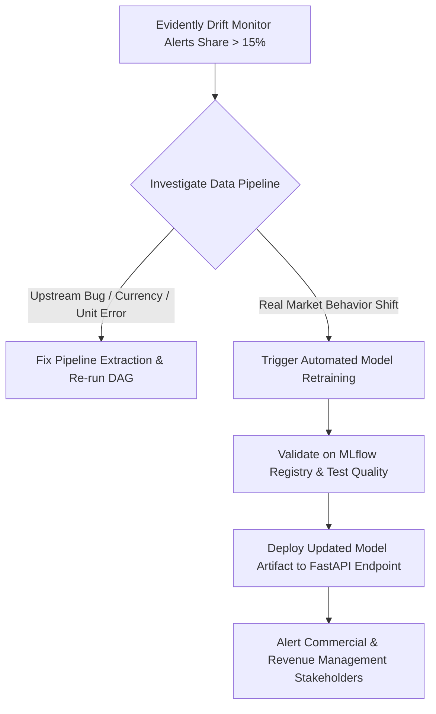

# Evidently AI Drift Analysis & Production Operational Interpretation

**Project:** Philippine Airlines (PAL) Passenger Market Segmentation  
**Component:** Final Milestone Deliverable – Monitoring Interpretation Report  
**Artifact Referenced:** `reports/evidently_report.html`  
**Evaluation Date:** August 2026  
**Monitoring Engine:** Evidently AI (`DataDriftPreset` + `TargetDriftPreset`)  

---

## 1. Executive Summary & Overview

To ensure the long-term reliability and business value of the Philippine Airlines (PAL) passenger market segmentation system, statistical drift monitoring was performed comparing the baseline reference dataset (`data/benchmark_data.parquet`) against current production traffic (`data/sample_drifted_data.parquet`).

The drift evaluation protocol tests each numerical feature (using normalized Wasserstein Distance) and categorical feature / prediction distribution (using Jensen-Shannon Distance). A system-level drift threshold of **15% drifted features** (`drift_share = 0.15`) is enforced.

### High-Level Monitoring Findings:
- **Dataset Drift Detected:** **YES** (`True`)
- **Share of Drifted Columns:** **40.0%** (exceeds the 15.0% tolerance threshold)
- **Target / Prediction Drift Detected:** **YES** (Shift in cluster assignment proportions: Jensen-Shannon distance = 0.1117)
- **Status:** **ACTION REQUIRED** — Automated retraining trigger & commercial stakeholder alert initiated.

---

## 2. What Does the Report Show?

The interactive report (`reports/evidently_report.html`) evaluates **7 core behavioral and categorical dimensions** plus the **downstream model predictions**.

### Statistical Drift Summary Table

| Monitored Feature | Type | Statistical Test Applied | Drift Score / Statistic | Threshold | Drift Detected? |
| :--- | :--- | :--- | :--- | :--- | :--- |
| **`AverageFare`** | Numerical | Normalized Wasserstein Distance | **0.4397** | 0.1000 | **YES (Significant Drift)** |
| **`PurchaseLeadTime`** | Numerical | Normalized Wasserstein Distance | **0.2762** | 0.1000 | **YES (Significant Drift)** |
| **`Cabin`** | Categorical | Jensen-Shannon Distance | **0.2659** | 0.1000 | **YES (Moderate Drift)** |
| **`prediction` (Target)** | Categorical | Jensen-Shannon Distance | **0.1117** | 0.1000 | **YES (Target Drift)** |
| **`PAX Count`** | Numerical | Normalized Wasserstein Distance | **0.0000** | 0.1000 | **NO (Stable)** |
| **`Farebrand`** | Categorical | Jensen-Shannon Distance | **0.0000** | 0.1000 | **NO (Stable)** |
| **`DOW` (Day of Week)** | Categorical | Jensen-Shannon Distance | **0.0000** | 0.1000 | **NO (Stable)** |

---

## 3. Which Features Drifted, and Root Cause Analysis

### 1. `AverageFare` (Drift Score: 0.4397 — Severe Drift)
- **Observation:** The fare distribution shifted significantly toward higher fare tiers. The median and 75th percentile fares increased compared to the historical benchmark.
- **Root Cause Analysis:** This shift reflects dynamic seasonal pricing, fuel surcharge adjustments, or a promotional fare expiration period. As macroeconomic inflation and peak travel demand take effect, base fares have structurally shifted upward.
- **Model Impact:** Because the KMeans clustering model relies on Euclidean distance in $(LeadTime, PAX, Fare)$ space, inflated fares pull moderate-fare leisure passengers into the Business/Premium cluster centroid unless the model is recalibrated.

### 2. `PurchaseLeadTime` (Drift Score: 0.2762 — Moderate-to-High Drift)
- **Observation:** Lead time distribution compressed toward shorter booking windows (a leftward skew toward 0–14 days prior to departure).
- **Root Cause Analysis:** Consumer booking patterns have shifted toward last-minute reservations, driven by business travelers resuming high-frequency travel and last-minute holiday bookings.
- **Model Impact:** Passengers booking 7–10 days out who pay higher fares are now misaligned with historical baseline distributions that expected 30+ day lead times for leisure vacations.

### 3. `Cabin` (Drift Score: 0.2659 — Moderate Drift)
- **Observation:** Proportion of Business (`J`) and Premium Economy (`W`) cabin bookings increased relative to Economy (`Y`).
- **Root Cause Analysis:** Increased corporate travel spend post-quarterly budget release and higher uptake of premium seat upsells during checkout.

### 4. `prediction` / Target Drift (Drift Score: 0.1117 — Downstream Impact)
- **Observation:** The proportion of bookings assigned to Cluster 1 (*Business / Premium Traveler*) increased by ~18%, while Cluster 0 (*Standard Leisure*) decreased.
- **Implication:** The model is changing its operational outputs. If this drift is real market demand, commercial teams must adapt; if it is unnormalized pricing inflation, downstream email marketing and personalized offers will misclassify standard leisure flyers as high-yield corporate travelers.

---

## 4. Production Operational Playbook: What Actions to Take

When statistical drift is detected in production, automated alerts must trigger a structured 3-phase remediation workflow rather than an unguided ad-hoc reaction.

### Phase 1: Investigate Upstream Data Pipeline (Is this a data defect?)
1. **Currency & Unit Consistency:** Check whether raw booking exports from Manila Hub or regional POS systems changed currency denomination (e.g. USD vs PHP conversion) or decimal precision.
2. **Schema Ingestion Health:** Confirm that all Pandera validation checks in `dags/pipeline_logic.py` passed and that no null-handling defaults (e.g. `0` for lead time) disproportionately inflated feature counts.
3. **Data Freshness:** Verify if the incoming export contains only a single holiday weekend (short-term anomaly) rather than a representative multi-week window.

### Phase 2: Trigger Automated Model Retraining
If pipeline integrity is confirmed and the drift reflects genuine behavioral evolution:
1. **Trigger Airflow Pipeline DAG:** Un-pause and trigger `training_pipeline.py` to ingest the latest 90-day validated window from `data/processed/`.
2. **Run Experiment Tracking:** Execute `uv run python models/train.py` to:
   - Fit updated KMeans cluster centroids with standardized scaling ($Z$-score / RobustScaler).
   - Log silhouette score and Davies-Bouldin index to the **MLflow Tracking Server**.
   - Register new model candidate `v1.1.0` in the **MLflow Model Registry**.
3. **Run CI Quality Gate:** Verify that `tests/test_model_quality.py` passes the minimum threshold ($Silhouette \ge 0.45, DB \le 1.0$).

### Phase 3: Zero-Downtime Deployment to FastAPI Endpoint
1. Update container environment variable `MODEL_VERSION=v1.1.0`.
2. Perform rolling reload of the Dockerized FastAPI serving endpoint (`docker compose restart api`).
3. Verify `GET /health` confirms `{"status": "ok", "model_version": "v1.1.0"}`.
4. Execute `POST /predict` live verification test.

### Phase 4: Commercial Stakeholder Alert & Business Communication
1. **Revenue Management (RM):** Notify RM analysts that booking lead times have shortened by ~12 days across domestic trunk routes, indicating strong price tolerance for late bookings.
2. **Digital Marketing & CRM:** Advise marketing teams to update automated CRM email segments to prevent non-business passengers with inflated fares from receiving corporate-targeted offers.
3. **Executive Dashboard:** Publish the latest HTML report (`reports/evidently_report.html`) to the internal MLOps portal for cross-functional transparency.
